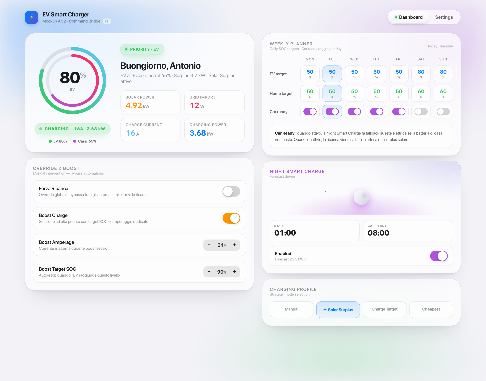
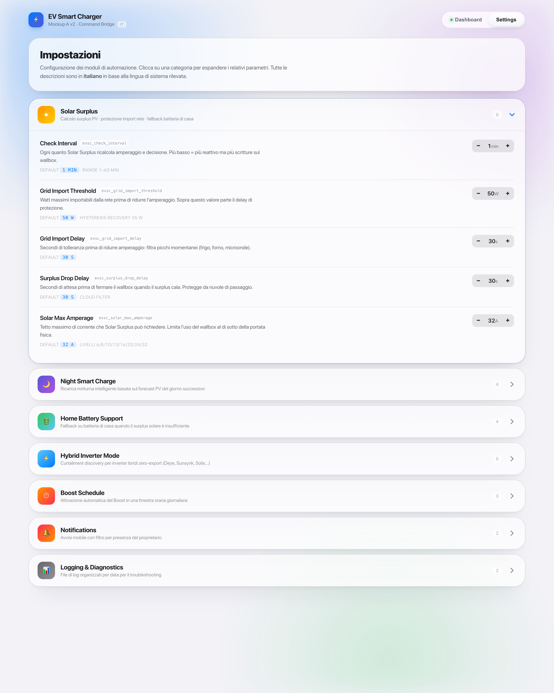
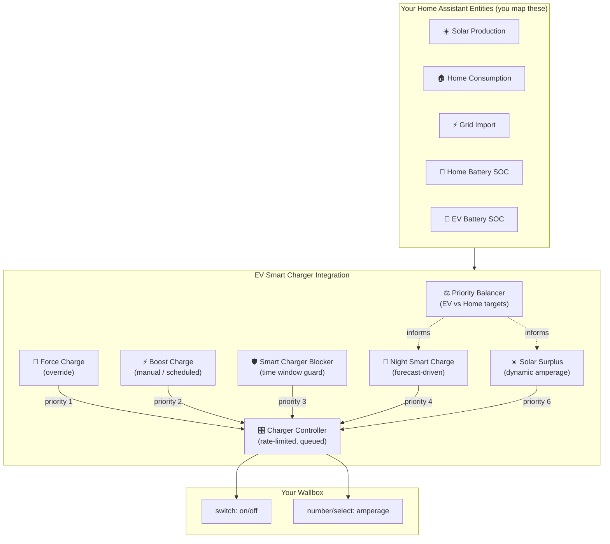
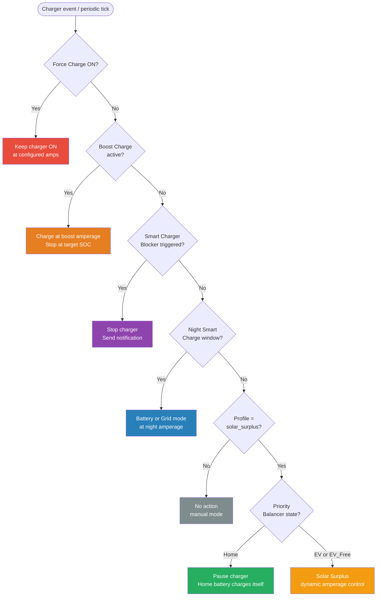
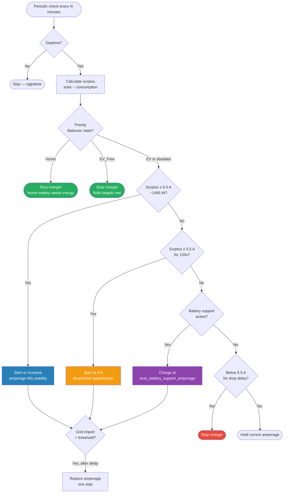
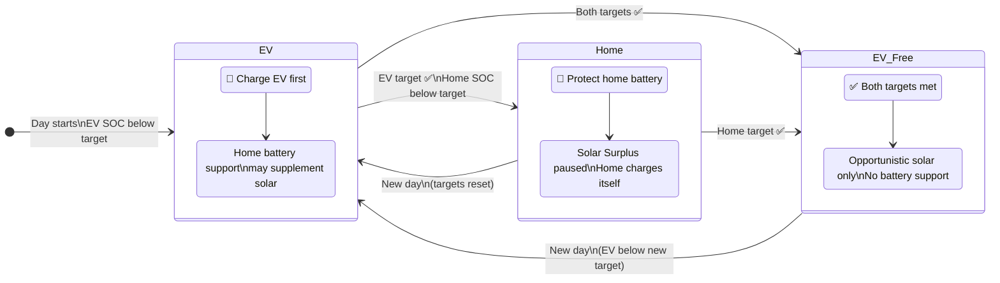
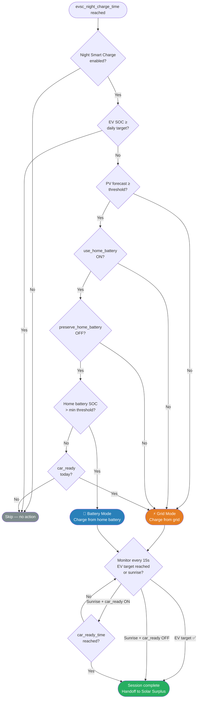
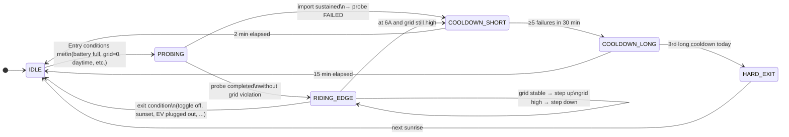

# EV Smart Charger

[](https://github.com/antbald/ha-ev-smart-charger/releases)
[](https://github.com/custom-components/hacs)
[](LICENSE)
[](https://www.home-assistant.io/)
[](https://github.com/antbald)

**Intelligent EV charging orchestration for Home Assistant.**

This custom integration maximises solar self-consumption by charging your EV with surplus PV energy, balances daily SOC targets between the car and a home battery, automates overnight charging driven by tomorrow's forecast, and protects the system from unsafe or unwanted charger activations.

## Preview

| Dashboard — operational view | Settings — configuration accordion |
|---|---|
|  |  |

The bundled Lovelace card is split into two views (**v1.10.0**): on the left, an operational dashboard with hero SOC ring, override + boost, weekly planner and a bento-style Night Smart Charge card. On the right, a settings page where every automation parameter is grouped under an expandable accordion with multilingual descriptions (EN / IT / NL, picked automatically from your Home Assistant profile language).

**Key features at a glance:**

- **Split-view dashboard** (v1.10.0+) — Dashboard and Settings tabs, accordion-grouped parameters with multilingual descriptions, system-detected language (no manual picker).
- **Auto-generated Liquid Glass dashboard** (v1.9.0+) — a sidebar dashboard with every entity pre-mapped appears the moment you finish setup. iOS 18 visual language, dual-ring SOC, zero YAML.
- Solar Surplus charging with dynamic amperage control (`6–32 A`) and a per-wallbox ceiling
- Priority Balancer — daily EV vs home battery SOC targets, automatically resolved
- Night Smart Charge — overnight charging from home battery or grid based on PV forecast
- Boost Charge — immediate high-priority session with automatic SOC stop, manual or scheduled
- Smart Charger Blocker — blocks charging outside your allowed window
- Cached EV SOC — reliable fallback for cloud-based car integrations
- Built-in diagnostic sensors, file logging, and trace logging

---

## Table of Contents

- [Preview](#preview)
- [How It Works](#how-it-works)
  - [Automation Priority System](#automation-priority-system)
- [Requirements](#requirements)
- [Installation](#installation)
  - [HACS (Recommended)](#hacs-recommended)
  - [Manual](#manual)
- [Configuration](#configuration)
  - [Step 1 — Name](#step-1--name)
  - [Step 2 — Charger Entities](#step-2--charger-entities)
  - [Step 3 — Energy Sensors](#step-3--energy-sensors)
  - [Step 4 — PV Forecast](#step-4--pv-forecast)
  - [Step 5 — Notifications](#step-5--notifications)
  - [Step 6 — External Connectors](#step-6--external-connectors)
  - [Step 7 — Auto-generated Dashboard](#step-7--auto-generated-dashboard)
  - [Reconfigure](#reconfigure)
- [Created Entities](#created-entities)
  - [Charging Profile](#charging-profile)
  - [Switches — Control](#switches--control)
  - [Switches — Notifications](#switches--notifications)
  - [Switches — Car Ready (daily)](#switches--car-ready-daily)
  - [Numbers — Solar Surplus](#numbers--solar-surplus)
  - [Numbers — Night Smart Charge](#numbers--night-smart-charge)
  - [Numbers — Boost Charge](#numbers--boost-charge)
  - [Numbers — Hybrid Inverter Mode](#numbers--hybrid-inverter-mode)
  - [Numbers — Daily EV SOC Targets](#numbers--daily-ev-soc-targets)
  - [Numbers — Daily Home Battery SOC Targets](#numbers--daily-home-battery-soc-targets)
  - [Time Controls](#time-controls)
  - [Sensors — Diagnostics](#sensors--diagnostics)
- [Automation Details](#automation-details)
  - [Solar Surplus](#solar-surplus)
  - [Priority Balancer](#priority-balancer)
  - [Night Smart Charge](#night-smart-charge)
  - [Boost Charge](#boost-charge)
  - [Smart Charger Blocker](#smart-charger-blocker)
  - [Hybrid Inverter Mode](#hybrid-inverter-mode-zero-export-systems)
  - [Cached EV SOC](#cached-ev-soc)
- [Auto-generated Dashboard](#auto-generated-dashboard)
  - [Look — Liquid Glass iOS 18](#look--liquid-glass-ios-18)
  - [Split-view organisation (v1.10.0+)](#split-view-organisation-v1100)
  - [Manual usage on your own dashboards](#manual-usage-on-your-own-dashboards)
- [Logging & Diagnostics](#logging--diagnostics)
- [Notifications & Presence](#notifications--presence)
- [Analytics & Privacy](#analytics--privacy)
- [Troubleshooting](#troubleshooting)
- [Supported Languages](#supported-languages)
- [Documentation](#documentation)
- [License](#license)

---

## How It Works

EV Smart Charger sits between your hardware (charger, inverter, home battery) and Home Assistant. You map your existing sensor and switch entities during setup; the integration then creates ~60 helper entities that drive all automation logic.

Only two charging profiles are selectable by the user: **`manual`** (no automation) and **`solar_surplus`** (automatic). All other features — Night Smart Charge, Boost Charge, Smart Charger Blocker, Priority Balancer — are independent modules that activate on top of the selected profile according to a fixed priority hierarchy.



### Automation Priority System

When multiple automations could act on the charger simultaneously, the integration resolves conflicts using this execution order:

| Priority | Component | Activation Condition |
|:---:|---|---|
| **1** | Force Charge (`evsc_forza_ricarica`) | Switch turned ON — overrides everything |
| **2** | Boost Charge | `evsc_boost_charge_enabled` ON or scheduled window active |
| **3** | Smart Charger Blocker | Charger starts outside allowed time window |
| **4** | Night Smart Charge | Current time ≥ `evsc_night_charge_time`, before sunrise |
| **5** | Priority Balancer | Evaluated inside Solar Surplus and Night Charge |
| **6** | Solar Surplus | Profile = `solar_surplus`, daytime hours |

Lower-priority automations only act when none of the higher-priority ones hold ownership of the charger.



---

## Requirements

**Mandatory — Charger:**

- A `switch` entity to turn the charger on/off
- A current control entity in one of: `number`, `input_number`, `select`, `input_select` (range `6–32 A`)
- A status sensor that reports one of the four accepted values:

  | Status Value | Meaning |
  |---|---|
  | `charger_charging` | Actively charging |
  | `charger_free` | Connected and idle / unplugged |
  | `charger_end` | Session finished |
  | `charger_wait` | Paused / waiting |

**Mandatory — Energy Sensors:**

- EV battery SOC (`%`)
- Solar production (`W`)
- Home consumption (`W`)
- Grid import (`W`, positive = importing, negative = exporting)

**Optional energy sensors:**

- Home battery SOC (`%`) — leave empty if you do not have a home battery. The integration will run in **PV-only mode** (see below).

**Optional but recommended:**

- A PV forecast sensor (`kWh`) for Night Smart Charge decision logic
- One or more `notify.mobile_app_*` services for push notifications
- A `person` entity for presence-aware notification filtering
- A `number` or `input_number` helper to receive the calculated nightly energy target

### PV-only mode (no home battery) — v1.7.0+

If you do not have a home battery installed, leave the **Home battery SOC** field empty during setup. The integration will automatically switch to **PV-only mode**:

- 13 helper entities related to the home battery are not created (51 entities total in v1.8.0; was 45 in v1.7.0 before Hybrid Inverter Mode added 6 helpers).
- Priority Balancer only returns `EV` or `EV_Free` — never `Home`.
- Solar Surplus charges the EV directly from solar surplus, without any home-battery support fallback.
- Night Smart Charge always uses **GRID MODE** (BATTERY MODE is disabled).
- Hybrid Inverter Mode (v1.8.0+) is technically available but stays IDLE in PV-only mode — its entry conditions require a home battery SOC sensor.

**Reconfigure restriction**: once a home battery sensor has been configured, the field stays required in the reconfigure / options flow. This prevents orphan helper entities from accumulating in the Home Assistant entity registry. To remove a home battery from an existing setup, delete the integration and add it again.

---

## Installation

### HACS (Recommended)

1. Open **HACS** in Home Assistant.
2. Go to **Integrations**.
3. Open the **Custom Repositories** dialog (three-dot menu).
4. Add `https://github.com/antbald/ha-ev-smart-charger` as category **Integration**.
5. Search for `EV Smart Charger` and install it.
6. Restart Home Assistant.

### Manual

1. Download the [latest release](https://github.com/antbald/ha-ev-smart-charger/releases).
2. Extract `custom_components/ev_smart_charger`.
3. Copy the folder to:

```
/config/custom_components/ev_smart_charger/
```

4. Restart Home Assistant.

---

## Configuration

Add the integration from **Settings → Devices & Services → Add Integration** and search for `EV Smart Charger`. The setup wizard has **7 steps**.

### Step 1 — Name

| Field | Required | Default |
|---|:---:|---|
| Integration name | No | `EV Smart Charger` |

Choose the display name used in the Home Assistant UI.

### Step 2 — Charger Entities

| Field | Required | Accepted Domains |
|---|:---:|---|
| Charger switch | Yes | `switch` |
| Charging current control | Yes | `number`, `input_number`, `select`, `input_select` |
| Charger status sensor | Yes | `sensor` |

The charger switch entity is used as the unique ID for the config entry. Adding the same charger twice is prevented automatically.

### Step 3 — Energy Sensors

| Field | Required | Unit |
|---|:---:|---|
| EV battery SOC | Yes | `%` |
| Home battery SOC | Yes | `%` |
| Solar production | Yes | `W` |
| Home consumption | Yes | `W` |
| Grid import | Yes | `W` |

### Step 4 — PV Forecast

| Field | Required | Unit |
|---|:---:|---|
| PV forecast sensor | No | `kWh` |

Used by Night Smart Charge to decide between home battery and grid charging. If omitted, Night Smart Charge will always fall back to grid mode.

### Step 5 — Notifications

| Field | Required | Notes |
|---|:---:|---|
| Notify services | No | Multiple `notify.mobile_app_*` services |
| Car owner | Yes | A `person` entity |

The `person` entity enables presence-based filtering: notifications are only sent when the car owner is home. If the entity is unavailable, notifications are sent anyway as a fail-safe.

### Step 6 — External Connectors

| Field | Required | Default | Validation |
|---|:---:|---|---|
| Battery capacity | Yes | `50.0 kWh` | `10–200 kWh` |
| Energy forecast target | No | — | `number` or `input_number` domain |

The energy forecast target is an external helper entity where the integration writes the calculated nightly forecast value. Useful for automations or dashboards that need this figure.

### Step 7 — Auto-generated Dashboard

| Field | Required | Default |
|---|:---:|---|
| Auto-generate sidebar dashboard | No | `ON` |

When enabled (default), the integration registers the bundled Lovelace card as a resource, creates a panel-mode dashboard at `/ev-smart-charger`, and adds it to the sidebar with the `mdi:ev-station` icon. The card is preloaded with the lowercased `entity_prefix` for this config entry and every sensor you mapped in the previous steps — zero YAML, ready to use the moment the wizard ends. Disable this toggle only if you prefer to add the card to your existing dashboards manually (see [Manual usage](#manual-usage-on-your-own-dashboards) below).

### Reconfigure

The integration supports native reconfiguration for existing entries. Navigate to **Settings → Devices & Services**, click on the integration entry, and select **Reconfigure** to update any mapping without deleting the entry and losing your helper entity states.

---

## Created Entities

After setup, the integration creates **64 entities** grouped under a single `EV Smart Charger` device:

| Platform | Count |
|---|:---:|
| `switch` | 21 |
| `number` | 31 |
| `select` | 1 |
| `time` | 4 |
| `sensor` | 8 |
| **Total** | **64** (v1.8.0, or **51** in PV-only mode) |

Entity IDs follow the pattern `<platform>.ev_smart_charger_<entry_id_fragment>_<suffix>`. The sections below use the suffix alone for brevity.

All helper entities persist their state across Home Assistant restarts via `RestoreEntity`.

---

### Charging Profile

| Suffix | Options | Default | Description |
|---|---|:---:|---|
| `evsc_charging_profile` | `manual`, `solar_surplus` | `manual` | Active charging mode |

---

### Switches — Control

| Suffix | Default | Description |
|---|:---:|---|
| `evsc_forza_ricarica` | OFF | **Force Charge** — global override. When ON, bypasses all automation decisions and keeps the charger running. |
| `evsc_boost_charge_enabled` | OFF | Enables a manual Boost Charge session immediately. Auto-clears when the SOC target is reached. |
| `evsc_boost_schedule_enabled` | OFF | Enables the daily Boost Charge schedule. Runs between `evsc_boost_schedule_start_time` and `evsc_boost_schedule_end_time`. |
| `evsc_smart_charger_blocker_enabled` | OFF | Enables the Smart Charger Blocker to prevent charging outside the allowed window. |
| `evsc_use_home_battery` | OFF | Allows Solar Surplus to draw from the home battery when solar alone is insufficient (requires Priority = EV). |
| `evsc_preserve_home_battery` | OFF | Prevents Night Smart Charge from discharging the home battery regardless of forecast. |
| `evsc_priority_balancer_enabled` | OFF | Enables the Priority Balancer to evaluate daily SOC targets. |
| `evsc_night_smart_charge_enabled` | OFF | Enables overnight automatic charging at the configured time. |
| `evsc_hybrid_inverter_mode` | OFF | **Hybrid Inverter Mode** — opt-in curtailment-discovery probing for zero-export hybrid inverter systems. See the [dedicated section](#hybrid-inverter-mode-zero-export-systems). |
| `evsc_enable_file_logging` | OFF | Enables daily file logging to `logs/<year>/<month>/<day>.log`. Toggle on to capture a session, off when done. |
| `evsc_trace_logging_enabled` | OFF | Enables verbose trace-level logging for deep debugging. |

---

### Switches — Notifications

| Suffix | Default | Description |
|---|:---:|---|
| `evsc_notify_smart_blocker_enabled` | ON | Send notification when Smart Charger Blocker stops the charger. |
| `evsc_notify_priority_balancer_enabled` | ON | Send notification when Priority Balancer state changes. |
| `evsc_notify_night_charge_enabled` | ON | Send notification when Night Smart Charge starts or stops. |

---

### Switches — Car Ready (daily)

One switch per weekday. Controls whether Night Smart Charge should ensure the car is ready (charged to target) by the `evsc_car_ready_time` deadline, even if this means continuing past sunrise.

| Suffix | Default | Applies to |
|---|:---:|---|
| `evsc_car_ready_monday` | ON | Monday |
| `evsc_car_ready_tuesday` | ON | Tuesday |
| `evsc_car_ready_wednesday` | ON | Wednesday |
| `evsc_car_ready_thursday` | ON | Thursday |
| `evsc_car_ready_friday` | ON | Friday |
| `evsc_car_ready_saturday` | OFF | Saturday |
| `evsc_car_ready_sunday` | OFF | Sunday |

When a day's flag is **ON** and the EV target is not yet reached at sunrise, Night Smart Charge continues until target or deadline — whichever comes first. When the flag is **OFF**, charging always stops at sunrise.

---

### Numbers — Solar Surplus

| Suffix | Default | Range | Unit | Description |
|---|:---:|---|:---:|---|
| `evsc_check_interval` | `1` | `1–60` | min | How often Solar Surplus recalculates. |
| `evsc_grid_import_threshold` | `50` | `0–1000` | W | Grid import above this level triggers amperage reduction. |
| `evsc_grid_import_delay` | `30` | `0–120` | s | How long grid import must persist before acting. |
| `evsc_surplus_drop_delay` | `30` | `0–120` | s | How long surplus must be insufficient before stopping the charger. |
| `evsc_solar_max_amperage` | `32` | `6–32` | A | Hard ceiling on Solar Surplus amperage. Lower this if your wallbox rejects currents above a certain value (e.g. set to `16` for wallboxes limited to 16 A). |
| `evsc_home_battery_min_soc` | `20` | `0–100` | % | Home battery must be above this SOC before battery support activates. |
| `evsc_battery_support_amperage` | `16` | `6–32` | A | Amperage used when the home battery supplements solar charging. |
| `evsc_battery_support_sunset_buffer` | `60` | `0–240` | min | Block home battery support when sunset is closer than this. Prevents draining the home battery in the last minutes of fading solar (e.g. plug-in at 18:00 with sunset at 19:15). Set to `0` to disable the guard. |

---

### Numbers — Night Smart Charge

| Suffix | Default | Range | Unit | Description |
|---|:---:|---|:---:|---|
| `evsc_night_charge_amperage` | `16` | `6–32` | A | Amperage for overnight charging sessions. |
| `evsc_min_solar_forecast_threshold` | `20` | `0–100` | kWh | If tomorrow's forecast ≥ this value, Night Smart Charge uses home battery mode instead of grid mode. |

---

### Numbers — Boost Charge

| Suffix | Default | Range | Unit | Description |
|---|:---:|---|:---:|---|
| `evsc_boost_charge_amperage` | `16` | `6–32` | A | Amperage used during a Boost Charge session. |
| `evsc_boost_target_soc` | `80` | `0–100` | % | Boost Charge stops automatically when EV SOC reaches this value. |

---

### Numbers — Hybrid Inverter Mode

Only relevant when `evsc_hybrid_inverter_mode` is **ON**. See the [Hybrid Inverter Mode](#hybrid-inverter-mode-zero-export-systems) section for full context.

| Suffix | Default | Range | Unit | Description |
|---|:---:|---|:---:|---|
| `evsc_hybrid_battery_full_threshold` | `95` | `80–100` | % | Home battery SOC required to consider the battery "full" and probe for curtailment. Raise this if your inverter only curtails at 100 %; lower it if curtailment kicks in earlier. |
| `evsc_hybrid_probe_duration` | `60` | `30–180` | s | Length of a single probe at 6 A. The first 20 s are a "transient grace" where grid_import is ignored (slow-ramp inverters need time to react). |
| `evsc_hybrid_max_import_duration` | `60` | `30–120` | s | Maximum sustained grid import (above `evsc_grid_import_threshold`) before backing off. Raise if your inverter has a slow ramp (Solis/Growatt may need 90–120 s). |
| `evsc_hybrid_max_failed_probes` | `5` | `1–10` | count | Number of failed probes within a 30-minute sliding window before entering a 15-minute long cooldown. After 3 long cooldowns in one day, the module disables itself until sunrise. |

---

### Numbers — Daily EV SOC Targets

Target EV SOC for each day of the week. Used by the Priority Balancer and Night Smart Charge to decide when the car is "done".

| Suffix | Default |
|---|:---:|
| `evsc_ev_min_soc_monday` | `50 %` |
| `evsc_ev_min_soc_tuesday` | `50 %` |
| `evsc_ev_min_soc_wednesday` | `50 %` |
| `evsc_ev_min_soc_thursday` | `50 %` |
| `evsc_ev_min_soc_friday` | `50 %` |
| `evsc_ev_min_soc_saturday` | `80 %` |
| `evsc_ev_min_soc_sunday` | `80 %` |

---

### Numbers — Daily Home Battery SOC Targets

Target home battery SOC for each day. Used by the Priority Balancer to determine when the home battery is satisfied.

| Suffix | Default |
|---|:---:|
| `evsc_home_min_soc_monday` | `50 %` |
| `evsc_home_min_soc_tuesday` | `50 %` |
| `evsc_home_min_soc_wednesday` | `50 %` |
| `evsc_home_min_soc_thursday` | `50 %` |
| `evsc_home_min_soc_friday` | `50 %` |
| `evsc_home_min_soc_saturday` | `50 %` |
| `evsc_home_min_soc_sunday` | `50 %` |

---

### Time Controls

| Suffix | Default | Description |
|---|:---:|---|
| `evsc_night_charge_time` | `01:00` | Time at which Night Smart Charge activates. |
| `evsc_car_ready_time` | `08:00` | Absolute deadline for car readiness on "Car Ready" days. Charging stops at this time even if the target SOC is not yet reached. |
| `evsc_boost_schedule_start_time` | `07:00` | Daily Boost Charge session start time. |
| `evsc_boost_schedule_end_time` | `08:00` | Daily Boost Charge session end time (hard stop). |

---

### Sensors — Diagnostics

All diagnostic sensors are **read-only**. They are updated continuously by the integration and are the first place to look when troubleshooting.

| Suffix | Description |
|---|---|
| `evsc_diagnostic` | General decision variables: current profile, active automation, charger state, last action. |
| `evsc_priority_daily_state` | Priority Balancer state (`EV` / `Home` / `EV_Free`), today's targets, current SOC values. |
| `evsc_solar_surplus_diagnostic` | Solar Surplus details: surplus watts, target amps, battery support state, delay timers. |
| `evsc_today_ev_target` | Today's EV SOC target (derived from the current weekday). |
| `evsc_today_home_target` | Today's home battery SOC target (derived from the current weekday). |
| `evsc_cached_ev_soc` | Last valid EV SOC value. Preserved when the source sensor becomes `unknown` or `unavailable`. |
| `evsc_log_file_path` | Full path to the active daily log file. Useful for SSH/Samba access. |
| `evsc_hybrid_inverter_diagnostic` | Hybrid Inverter Mode state machine: `IDLE`, `PROBING (45/60s)`, `RIDING_EDGE @ 10A`, `COOLDOWN_LONG (8m left)`, `HARD_EXIT (until sunrise)`. Attributes carry failure counts, cooldown timers, and full snapshot. |

---

## Automation Details

### Solar Surplus

Solar Surplus runs every `evsc_check_interval` minutes during **daytime hours only** (sunrise → sunset). It computes the instantaneous surplus (`solar production − home consumption`) and converts it to the nearest supported amperage level from `[6, 8, 10, 13, 16, 20, 24, 32] A` using 230 V as the conversion voltage.

**Hysteresis and stability protection:**

- Charger does not start until surplus is ≥ 6.5 A (`~1495 W`) for at least 60 s (cloud protection)
- A dead-band timer: if surplus stays ≥ 5.5 A (`~1265 W`) for 120 consecutive seconds while the charger is off, charging starts at 6 A (opportunistic dead-band start)
- Charger stops only if surplus drops below 5.5 A for `evsc_surplus_drop_delay` seconds
- Amperage increases require 60 s of stable surplus; decreases require only `evsc_surplus_drop_delay`

The diagram below shows how the surplus (in amps) maps to charging decisions. Thresholds are fixed; only the dead-band start delay is configurable via `SURPLUS_DEADBAND_START_DELAY`.

```
Surplus (A)
  │
  32 ┤━━━━━━━━━━━━━━━━━━━━━━━━━━━━━  ← max level (capped by evsc_solar_max_amperage)
  24 ┤
  20 ┤
  16 ┤────────────────────────────── ← amperage steps [6,8,10,13,16,20,24,32]
  13 ┤
  10 ┤
   8 ┤
   6 ┤
     │
 6.5 ┤╌╌╌╌╌╌╌╌╌╌╌╌╌╌╌╌╌╌╌╌╌╌╌╌╌╌╌  ← START threshold (needs 60s stable)
 5.5 ┤╌╌╌╌╌╌╌╌╌╌╌╌╌╌╌╌╌╌╌╌╌╌╌╌╌╌╌  ← STOP threshold / dead-band floor
     │    ↕ dead band (no action    ← dead-band start after 120s
     │      unless timer expires)
   0 ┤─────────────────────────────→ time
```



**Grid import protection:**

If grid import exceeds `evsc_grid_import_threshold` for more than `evsc_grid_import_delay` seconds, amperage is reduced by one step. Recovery requires surplus to drop below 50 % of the threshold and remain there for 60 s before amperage is restored one step at a time.

**Home battery support** (optional):

When `evsc_use_home_battery` is ON, home battery SOC ≥ `evsc_home_battery_min_soc`, and Priority Balancer state = `EV`, the home battery supplements solar. If surplus < 6 A but battery support is active, the charger runs at `evsc_battery_support_amperage` instead of stopping.

Battery support is also blocked when sunset is within `evsc_battery_support_sunset_buffer` minutes (default 60 min). This prevents draining the home battery for the last minutes of fading solar — e.g. when the car is plugged in at 18:00 with sunset at 19:15. Charging continues on solar surplus only; when surplus drops below threshold the charger stops normally. Set the buffer to `0` to disable this guard.

**Solar max amperage cap:**

`evsc_solar_max_amperage` (default `32 A`) sets a hard ceiling so Solar Surplus never exceeds what your wallbox accepts. Set this to `16` if your wallbox rejects `20 A` or higher commands.

---

### Priority Balancer

The Priority Balancer reads today's EV and home battery SOC targets (from the daily entities) and compares them against current sensor values. It resolves to one of three states:

| State | Meaning | Effect on Solar Surplus |
|---|---|---|
| `EV` | EV SOC below today's target | Solar charges EV; home battery support may activate |
| `Home` | EV target met, home battery below target | Solar Surplus pauses; home battery charges itself |
| `EV_Free` | Both targets met | Solar Surplus stops immediately; opportunistic charging only if profile allows |



When the balancer is **disabled**, Solar Surplus treats the charger as always having `EV` priority.

**Key entities:** `evsc_priority_balancer_enabled`, `evsc_ev_min_soc_<day>`, `evsc_home_min_soc_<day>`, `sensor.evsc_priority_daily_state`

---

### Night Smart Charge

Night Smart Charge activates at `evsc_night_charge_time` (default `01:00`) and runs until the EV reaches its daily SOC target or sunrise, whichever comes first.

**Mode selection** (evaluated at activation):

| Condition | Mode |
|---|---|
| PV forecast ≥ `evsc_min_solar_forecast_threshold` AND `evsc_use_home_battery` ON AND `evsc_preserve_home_battery` OFF | **Battery mode** — charges from home battery |
| Any other condition | **Grid mode** — charges from grid |



**Battery mode pre-check:** Before starting, the home battery SOC is validated. If it is already ≤ `evsc_home_battery_min_soc`, the session checks the day's `evsc_car_ready_<day>` flag:
- Flag **ON** → falls back to grid mode to ensure car is ready
- Flag **OFF** → skips charging entirely (waits for solar surplus)

**Car Ready extension:** On days where `evsc_car_ready_<day>` is ON, if the EV target is not reached at sunrise, charging continues from the grid until the target is met or `evsc_car_ready_time` is reached.

**Late-arrival detection:** If the car is plugged in after `evsc_night_charge_time` but before sunrise, Night Smart Charge detects the late arrival and starts a session immediately.

**Charger start retry:** If the charger fails to start on the first attempt, Night Smart Charge retries with exponential backoff before giving up and logging an error.

**Key entities:** `evsc_night_smart_charge_enabled`, `evsc_night_charge_time`, `evsc_night_charge_amperage`, `evsc_min_solar_forecast_threshold`, `evsc_car_ready_<day>`, `evsc_car_ready_time`, `evsc_preserve_home_battery`

---

### Boost Charge

Boost Charge is a high-priority override that guarantees the EV reaches `evsc_boost_target_soc` as quickly as possible at `evsc_boost_charge_amperage`.

**Manual mode:** Toggle `evsc_boost_charge_enabled` ON at any time. The session starts immediately, runs at full configured amperage, and stops automatically when the SOC target is reached. The switch reverts to OFF on completion.

**Scheduled mode:** Enable `evsc_boost_schedule_enabled` and configure `evsc_boost_schedule_start_time` / `evsc_boost_schedule_end_time`. Every day at the start time the integration checks:
- Car plugged in? If not, the session is silently skipped.
- EV SOC already ≥ target? If so, the session is silently skipped.
- Otherwise, charging starts at `evsc_boost_charge_amperage`.

If the car is plugged in *after* the start time but while still within the scheduled window, the session starts immediately on plug-in — no manual intervention needed.

The session ends at the configured end time even if the SOC target has not been reached. Disabling the schedule toggle mid-session stops the charger immediately.

**Key entities:** `evsc_boost_charge_enabled`, `evsc_boost_schedule_enabled`, `evsc_boost_charge_amperage`, `evsc_boost_target_soc`, `evsc_boost_schedule_start_time`, `evsc_boost_schedule_end_time`

---

### Smart Charger Blocker

Smart Charger Blocker listens for `charger_charging` status events and stops the charger if the activation occurs inside the blocking window.

**Blocking window:**

- When Night Smart Charge is **enabled**: sunset → `evsc_night_charge_time`
- When Night Smart Charge is **disabled**: sunset → sunrise

**Charging is allowed when any of the following apply:**

- `evsc_forza_ricarica` is ON (Force Charge override)
- Night Smart Charge owns the active session
- A Boost Charge session is active
- `evsc_smart_charger_blocker_enabled` is OFF

When the blocker stops the charger, it sends a push notification (if `evsc_notify_smart_blocker_enabled` is ON and the car owner is home) and enforces a 30-minute re-check window to prevent log spam.

**Key entities:** `evsc_smart_charger_blocker_enabled`, `evsc_forza_ricarica`, `evsc_notify_smart_blocker_enabled`

---

### Hybrid Inverter Mode (zero-export systems)

**Opt-in feature (default OFF).** Added in v1.8.0 to solve [issue #20](https://github.com/antbald/ha-ev-smart-charger/issues/20).

#### What problem this solves

In **hybrid zero-export inverter systems** (Deye, Sunsynk, Solis, Growatt, Goodwe, EG4 and similar), the inverter actively **curtails** PV production to avoid feeding energy back into the grid when there is nowhere to put it. Typically this happens whenever the home battery is full and grid export is disabled.

When this happens the sensor `fv_production` (which reports *measured* PV power, not *available* PV power) drops to roughly match `home_consumption`. Solar Surplus then computes:

```
surplus = fv_production − home_consumption ≈ 0
```

and decides there is no headroom for EV charging — **even though several kilowatts of PV capacity are sitting idle**, ready to ramp up the moment any load is applied. The EV charger never starts on a perfectly sunny day. This is a paradox: the very condition that means PV is being wasted (battery full + zero export) also masks the available surplus.

#### Who needs this

Enable Hybrid Inverter Mode if **all** of these apply to you:

- ✅ Your inverter is a hybrid model with battery + zero-export configured
- ✅ Your home battery is frequently full during sunny midday hours
- ✅ Solar Surplus often shows `~0 W surplus` even on clear days
- ✅ The EV charger does not start automatically when you expect it to
- ✅ You can verify (in the inverter's own UI) that PV production is being capped

If you have a **traditional** PV-only system, a **grid-tied non-hybrid** inverter, or you never see your home battery reach 100 %, **leave this feature OFF** — it will not improve anything and may briefly draw small amounts of power from the grid.

#### How it works — probing strategy

Since the inverter only ramps up PV in response to a load, the only way to discover hidden headroom is **empirical**: start the EV charger at the minimum 6 A and observe what `grid_import` does. This is exactly what Hybrid Inverter Mode does.



Two-phase probing protects against inverter slow-ramp:

1. **Phase A (0–20 s, "transient grace"):** charger at 6 A, `grid_import` is **ignored**. This is the window where the inverter detects the new load and starts ramping PV up.
2. **Phase B (20–60 s, "steady state"):** if `grid_import > evsc_grid_import_threshold` for more than `evsc_hybrid_max_import_duration` consecutive seconds → probe **FAILED** (no headroom). Otherwise → probe **SUCCEEDED**.

After a successful probe, Hybrid Mode transitions to **RIDING_EDGE** where it "rides the edge" of `grid_import`:

- Grid stays below 50 % of threshold for 60 s → step amperage **up** one level (6 → 8 → 10 → 13 → 16 → 20 → 24 → 32 A)
- Grid exceeds threshold for `evsc_hybrid_max_import_duration` → step amperage **down** one level
- At 6 A and grid still high → stop and treat as a failed probe

#### Cost transparency

Every failed probe consumes **~23 Wh from the grid** (6 A × 230 V × 60 s). The module is designed so the **daily worst case is bounded at ≤ 350 Wh** — a fraction of one cent of electricity:

- A sliding window prevents more than 5 failed probes per 30 minutes
- The 6th failure triggers a 15-minute long cooldown
- After 3 long cooldowns in the same day, the module disables itself until sunrise (`HARD_EXIT`)

These limits are tuned so that even in the worst case (e.g. inverter that really has no headroom but conditions briefly look right), Hybrid Mode never costs more than a tenth of a kWh per day. In normal use it costs nothing — once `RIDING_EDGE` is sustained for 5 minutes, the failure counter is reset.

#### How to enable

1. Verify you are a candidate (see "Who needs this" above).
2. Toggle **`switch.evsc_hybrid_inverter_mode` ON**.
3. *(Recommended)* lower `number.evsc_check_interval` to **15–30 s** for more responsive amperage adjustments while in RIDING_EDGE. The default of 1 minute works but feels sluggish.
4. Leave the other Hybrid parameters at their defaults initially. They can be tuned later based on observed behaviour (see "Tuning" below).
5. Wait for a sunny day with the home battery full. Hybrid Mode will activate by itself when conditions are right.
6. Watch `sensor.evsc_hybrid_inverter_diagnostic` and the integration logs to see what is happening.

You will receive **one push notification per day** (filtered by car-owner presence) the first time probing starts. After that, no further notifications — the module operates silently.

#### Tuning

| Symptom | Try |
|---|---|
| Hybrid Mode never enters `PROBING` | Lower `evsc_hybrid_battery_full_threshold` (e.g. from 95 % to 90 %). Some inverters curtail before reaching 100 %. |
| Every probe fails (`COOLDOWN_SHORT` then `COOLDOWN_LONG`) | Raise `evsc_hybrid_max_import_duration` to 90–120 s. Slow-ramp inverters (Solis, Growatt) need more time to react. |
| Module enters `HARD_EXIT` too often | Your inverter probably has genuine PV constraints (small system, partial shading). Raise `evsc_hybrid_battery_full_threshold` to 100 % so probing only happens when truly full. |
| RIDING_EDGE oscillates a lot | Raise `evsc_grid_import_threshold` slightly (from 50 W default to 100 W) for more headroom. |

#### Interaction with other automations

Hybrid Mode is fully integrated with the existing priority hierarchy:

- **Force Charge / Boost Charge / Night Smart Charge / Charger Free / Profile change** → Hybrid is **forced to exit** gracefully. The EV charger is stopped, state returns to IDLE, the other automation takes over.
- **Priority Balancer = HOME** → Hybrid cannot start (the home battery's needs come first).
- **Priority Balancer = EV_FREE** → Hybrid is allowed to continue **only if the home battery is at 100 %** (strict). The moment it drops to 99 %, Hybrid exits gracefully to preserve the battery for the evening.
- **Sunset buffer (90 min)** → Hybrid never starts a probe in the last 90 minutes before sunset, to avoid draining the home battery during fading solar.

#### Diagnostic sensor

`sensor.evsc_hybrid_inverter_diagnostic` exposes the full state machine in real time:

| State string | Meaning |
|---|---|
| `IDLE` | Waiting for entry conditions |
| `PROBING (XX/60s)` | Currently probing at 6 A, XX seconds elapsed of the probe_duration window |
| `RIDING_EDGE @ 10A` | Actively riding the import edge at 10 A |
| `COOLDOWN_SHORT (110s left)` | Recovering from a single failed probe |
| `COOLDOWN_LONG (8m 30s left)` | Recovering from N failures in 30 minutes |
| `HARD_EXIT (until sunrise)` | Disabled for the day after 3 long cooldowns |

The sensor's **attributes** carry the full diagnostic snapshot: failed probes in window, long cooldowns today, last probe time, current target amps, cooldown timers, and reason for the last state transition.

#### Compatibility

Hybrid Inverter Mode is **inverter-agnostic** by design — it uses no inverter-specific API and only reads the same `grid_import` and `soc_home` sensors you already configured during setup. Any hybrid inverter that exposes those two values via Home Assistant should work.

If you test it with your specific inverter brand/model, please share your results (success or otherwise) on **[issue #20](https://github.com/antbald/ha-ev-smart-charger/issues/20)** so other users can benefit.

**Key entities:** `evsc_hybrid_inverter_mode`, `evsc_hybrid_battery_full_threshold`, `evsc_hybrid_probe_duration`, `evsc_hybrid_max_import_duration`, `evsc_hybrid_max_failed_probes`, `sensor.evsc_hybrid_inverter_diagnostic`

---

### Cached EV SOC

Many cloud-based EV integrations (e.g., manufacturer apps) expose SOC sensors that temporarily go `unknown` or `unavailable` due to API rate limits or connectivity issues. This causes downstream automations to fail or make wrong decisions.

The Cached EV SOC component polls the source EV SOC sensor every **5 seconds** and writes the last valid value to `sensor.evsc_cached_ev_soc`. When the source goes unavailable, the cached value is preserved until a new valid reading arrives. All internal logic uses the cached sensor, not the source directly.

**Key entity:** `sensor.evsc_cached_ev_soc`

---

## Auto-generated Dashboard

Since **v1.9.0** the integration provisions a Lovelace dashboard for you on first setup — no resource registration, no YAML, no entity mapping. Leave the toggle in [Step 7](#step-7--auto-generated-dashboard) at its default value and a panel-mode dashboard named **EV Smart Charger** appears in your sidebar at `/ev-smart-charger`, fully populated with the entities of the just-configured entry.

What the integration does for you under the hood:

1. Registers `/api/ev_smart_charger/frontend/ev-smart-charger-dashboard.js` as a Lovelace `module` resource.
2. Creates a storage-mode dashboard with `url_path: ev-smart-charger`, `mdi:ev-station` icon, and shows it in the sidebar.
3. Writes a single panel-mode view containing the EV Smart Charger custom card pre-filled with:
   - `entity_prefix` derived from this entry's `entry_id` (lowercased, as required since v1.6.23)
   - every user-mapped sensor from Steps 2–4 (`ev_soc_entity`, `home_battery_soc_entity`, `solar_power_entity`, `grid_import_entity`, `home_consumption_entity`, `charger_status_entity`, `current_entity`, `charger_switch_entity`, `pv_forecast_entity`)

Toggling Step 7 off (initial wizard or via **Reconfigure**) removes the dashboard from the sidebar; toggling it back on recreates it with the current mapping. Multi-entry installs are handled safely: the dashboard is preserved as long as at least one active entry still has the toggle enabled.

> If your Home Assistant runs Lovelace in YAML mode the integration cannot create dashboards programmatically. It will log a warning and you can fall back to [Manual usage](#manual-usage-on-your-own-dashboards) below — the bundled card is still served and works the same way.

### Look — Liquid Glass iOS 18

The card uses an Apple-inspired visual language:

- **Activity-style dual SOC ring** in the hero: outer arc tracks EV SOC, inner arc tracks home battery SOC (hidden in PV-only mode). Center reads the EV percentage with the "EV" label inside; a separate **CHARGING** pill below the ring shows live amperage and power when a session is active.
- **Liquid Glass surfaces** — every card uses `backdrop-filter: saturate(180%) blur(40px)` over a layered aurora background.
- **Apple System Colors** throughout: system green for EV SOC and ON toggles, system blue for selected profile chip, system purple for home battery and `EV_Free` priority state.
- **iOS-spec toggles** (51×31 pill, 27px thumb) with 280 ms spring transitions.
- **SF Pro typography stack** with tabular numerals on metric values.
- **Native dark/light** — switches automatically via `prefers-color-scheme`, no theme tweaks required.
- **Accessible motion** — respects `prefers-reduced-motion`.

### Split-view organisation (v1.10.0+)

The card now ships with two tabs at the top:

- **Dashboard** — operational only. Hero with dual SOC ring + charging pill, Override & Boost stack, Weekly Planner (per-day EV/home SOC targets + Car Ready toggle), bento-style Night Smart Charge card with crescent illustration, and Charging Profile chips.
- **Settings** — every configuration parameter grouped under expandable accordion categories: Solar Surplus, Night Smart Charge, Home Battery Support, Hybrid Inverter Mode, Boost Schedule, Notifications, Logging & Diagnostics. Each parameter shows its title, the underlying entity key, a description of what it does and the default/range — all in the language detected from your Home Assistant profile (`en` / `it` / `nl`, English fallback for everything else).

Click a category to expand its parameters inline; clicking again collapses it. The Dashboard view stays clutter-free while every knob remains one click away.

### Manual usage on your own dashboards

If you disabled Step 7 or want the card in an existing dashboard, the bundled module is still served by the integration. Add the resource once:

```yaml
lovelace:
  resources:
    - url: /api/ev_smart_charger/frontend/ev-smart-charger-dashboard.js
      type: module
```

Then drop the card into any view:

```yaml
type: custom:ev-smart-charger-dashboard
title: EV Smart Charger
entity_prefix: ev_smart_charger_<entry_id_lowercased>
ev_soc_entity: sensor.tesla_battery
home_battery_soc_entity: sensor.home_battery_soc
solar_power_entity: sensor.solar_production
grid_import_entity: sensor.grid_import_w
charger_status_entity: sensor.wallbox_status
current_entity: number.wallbox_current
charger_switch_entity: switch.wallbox_charging
charging_power_entity: sensor.current_charging_power
pv_forecast_entity: sensor.pv_forecast_tomorrow
```

**Full configuration reference:**

| Parameter | Required | Description |
|---|:---:|---|
| `entity_prefix` | **Yes** | Prefix that matches the integration's config entry. Lowercase. Find it in your entity IDs (the part between `ev_smart_charger_` and `_evsc_*`). |
| `title` | No | Card title shown in the header. |
| `ev_soc_entity` | No | Sensor for current EV battery level — drives the outer SOC ring. |
| `home_battery_soc_entity` | No | Sensor for current home battery level — drives the inner SOC ring. |
| `solar_power_entity` | No | Sensor for solar production. |
| `grid_import_entity` | No | Sensor for grid import/export. |
| `home_consumption_entity` | No | Sensor for instantaneous home consumption. |
| `charger_status_entity` | No | Wallbox status sensor (`charger_charging`, `charger_free`, …). |
| `current_entity` | No | Number entity for current wallbox amperage. |
| `charger_switch_entity` | No | Switch entity that starts/stops the charger. |
| `charging_power_entity` | No | Sensor for live charging power (kW). Used in the ring center when charging. |
| `pv_forecast_entity` | No | Sensor with tomorrow's PV forecast (kWh). |

The card calls Home Assistant services directly (`switch.toggle`, `number.set_value`, `select.select_option`, `time.set_value`) using `entity_prefix` to resolve helper entities.

---

## Logging & Diagnostics

### Diagnostic Sensors

The quickest way to understand what the integration is doing is to inspect the diagnostic sensors in **Developer Tools → States**:

- `evsc_diagnostic` — overall decision state
- `evsc_solar_surplus_diagnostic` — solar surplus calculation details
- `evsc_priority_daily_state` — today's priority state and SOC comparisons

### File Logging

Enable `evsc_enable_file_logging` to write all integration activity to a dedicated daily file. Logs are stored at:

```
/config/custom_components/ev_smart_charger/logs/<year>/<month>/<day>.log
```

A new file is created automatically at midnight. Previous days are kept indefinitely. Access log files via SSH, the File Editor add-on, or Samba share.

When troubleshooting is complete, disable the toggle to stop writing. Existing log files are preserved.

### Trace Logging

Enable `evsc_trace_logging_enabled` for verbose output including every sensor read, every calculation step, and every state transition. Intended for short diagnostic sessions — disable immediately after use to avoid performance impact.

### HA Debug Logging

For lower-level Home Assistant framework logging, add to `configuration.yaml`:

```yaml
logger:
  default: info
  logs:
    custom_components.ev_smart_charger: debug
```

Restart Home Assistant for the change to take effect. Logs appear in **Settings → System → Logs** (search for `evsc`).

---

## Notifications & Presence

Push notifications are sent via the `notify.mobile_app_*` services configured during setup. The car owner `person` entity enables **presence-aware filtering**: a notification is only dispatched when the person's state is `home`.

If the `person` entity is unavailable, notifications are always sent (fail-safe default). If no notify services are configured, no notifications are sent.

**Per-feature notification toggles:**

| Switch | Default | Controls |
|---|:---:|---|
| `evsc_notify_smart_blocker_enabled` | ON | Notifications when Smart Charger Blocker stops the charger |
| `evsc_notify_priority_balancer_enabled` | ON | Notifications when Priority Balancer state changes |
| `evsc_notify_night_charge_enabled` | ON | Notifications when Night Smart Charge starts or completes |

---

## Analytics & Privacy

EV Smart Charger sends one anonymous ping per day to help the maintainer track active installations, version adoption, and approximate geographic distribution.

**What is sent:**

| Field | Example | Purpose |
|---|---|---|
| `installation_id` | `a3f2…` (random UUID) | Count unique installs — never reused across uninstalls |
| `version` | `1.6.18` | Version adoption tracking |
| `ha_version` | `2026.4.0` | HA compatibility insight |
| `timezone` | `Europe/Rome` | Approximate region |
| `country` | `IT` | Derived from timezone — no geolocation |
| `continent` | `EU` | Aggregate geographic distribution |

**What is NOT sent:** IP address, hostname, entity IDs, sensor values, configuration data, credentials, or any personally identifiable information.

Data is stored in a private sheet accessible only to the maintainer. Aggregated statistics may be published publicly.

**Opt-out:** Set the environment variable `EVSC_DISABLE_TELEMETRY=true` on your Home Assistant host (e.g., in `/etc/environment` or your Docker Compose file).

---

## Troubleshooting

**Start with these checks:**

1. Confirm the mapped charger switch can be toggled manually in **Developer Tools → Services**.
2. Confirm the charger status sensor returns one of the four accepted values (`charger_charging`, `charger_free`, `charger_end`, `charger_wait`). Custom or localised values will not be recognised.
3. Confirm solar production, home consumption, and grid import sensors report values in Watts (`W`). kW-scale sensors will result in wrong surplus calculations.
4. If EV SOC comes from a cloud integration, check `sensor.evsc_cached_ev_soc` — the source may be intermittently unavailable.
5. Check the diagnostic sensors and, if needed, enable file logging for a full session trace.

**Common mistakes:**

| Symptom | Likely Cause |
|---|---|
| Night Smart Charge never activates | `evsc_night_smart_charge_enabled` is OFF, or EV target already met at `01:00` |
| Solar Surplus starts late or not at all | Surplus below 1495 W (6.5 A threshold), or profile not set to `solar_surplus` |
| Charger keeps getting blocked | Smart Charger Blocker is ON and charger started during the blocking window |
| Notifications not arriving | `person` entity is not `home`, or notify service name is wrong |
| Amperage stuck at low value | `evsc_solar_max_amperage` is set lower than expected, or grid import protection is active |

**Useful entities for investigation:**

- `sensor.*_evsc_diagnostic`
- `sensor.*_evsc_solar_surplus_diagnostic`
- `sensor.*_evsc_priority_daily_state`
- `sensor.*_evsc_log_file_path`
- `sensor.*_evsc_cached_ev_soc`

---

## Supported Languages

The integration ships translated UI strings and runtime messages for:

| Language | Code | Status |
|---|:---:|:---:|
| English | `en` | ✅ Full |
| Italian | `it` | ✅ Full |
| Dutch | `nl` | ✅ Full |

Available documentation:

- English: this README
- Dutch: [docs/README.nl.md](docs/README.nl.md)

---

## Documentation

**User-facing:**

- Main guide: this README
- [Dutch guide](docs/README.nl.md)

**Technical and maintenance:**

- [Documentation index](docs/README.md)
- [Architecture SSOT](docs/SSOT.md)
- [Codebase map](docs/CODEBASE_MAP.md)
- [Refactor plan / hardening record](docs/REFACTOR_PLAN.md)

---

## License

MIT. See [LICENSE](LICENSE).
